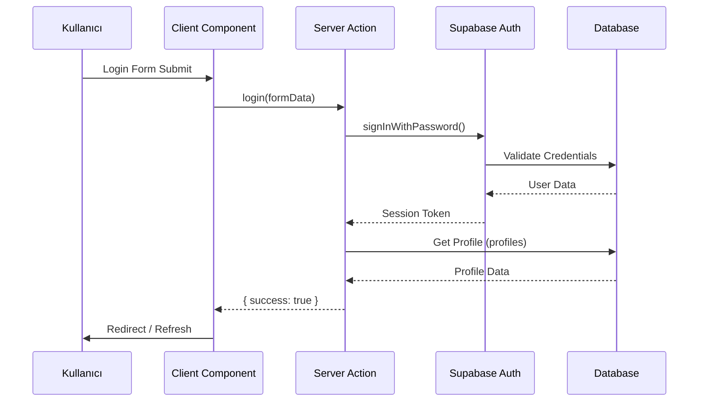
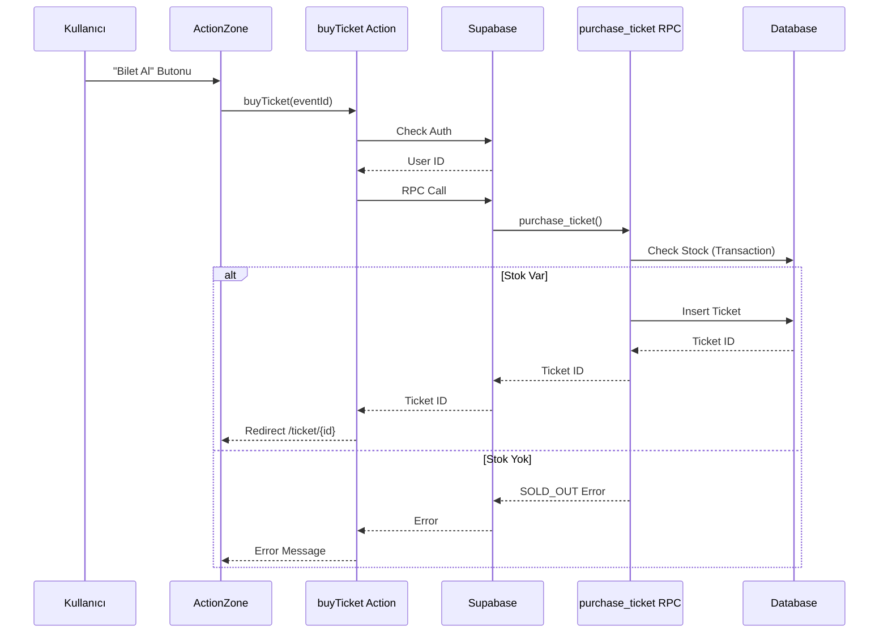
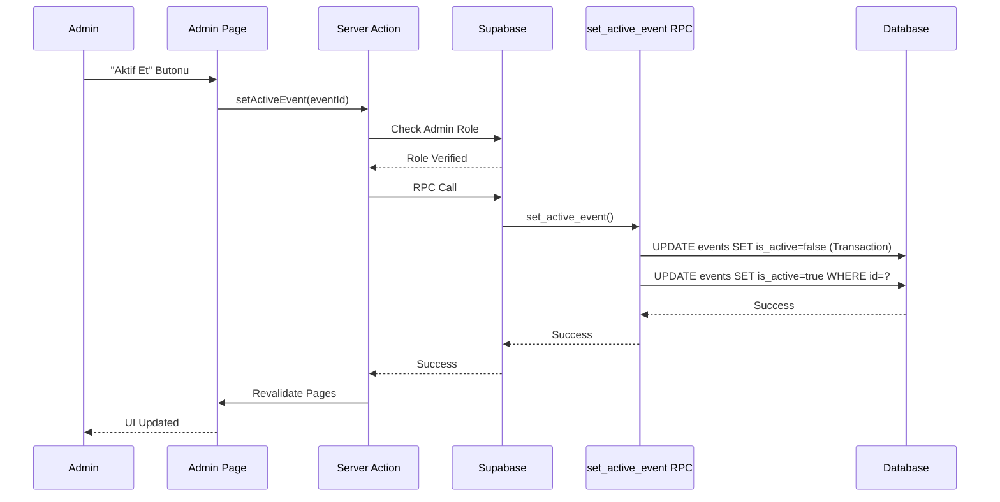

# Mimari Dokümantasyon

Bu doküman, TALPA Etkinlik Platformu'nun sistem mimarisi, veri akışı ve tasarım kararlarını açıklar.

## İçindekiler

- [Sistem Mimarisi](#sistem-mimarisi)
- [Veri Akış Diyagramları](#veri-akış-diyagramları)
- [Tasarım Prensibi](#tasarım-prensipleri)
- [Güvenlik Mimarisi](#güvenlik-mimarisi)
- [Performans Optimizasyonları](#performans-optimizasyonları)
- [Ölçeklenebilirlik](#ölçeklenebilirlik)

## Sistem Mimarisi

### Genel Mimari

TALPA Etkinlik Platformu, modern web standartlarına uygun, serverless ve ölçeklenebilir bir mimari üzerine kurulmuştur.

```
┌─────────────────┐
│   Kullanıcı     │
│   (Browser)     │
└────────┬────────┘
         │
         │ HTTPS
         ▼
┌─────────────────┐
│   Vercel/       │
│   Netlify       │
│   (CDN + Edge)  │
└────────┬────────┘
         │
         │ API Calls
         ▼
┌─────────────────┐
│   Next.js       │
│   App Router    │
│   (Server)      │
└────────┬────────┘
         │
    ┌────┴────┐
    │         │
    ▼         ▼
┌────────┐ ┌──────────┐
│Supabase│ │Supabase  │
│  Auth  │ │Database  │
└────────┘ └──────────┘
```

### Katmanlar

1. **Presentation Layer (Sunum Katmanı)**
   - React Components (Client & Server)
   - Next.js App Router
   - Tailwind CSS

2. **Application Layer (Uygulama Katmanı)**
   - Server Actions
   - Middleware
   - Context API

3. **Data Layer (Veri Katmanı)**
   - Supabase Client (Browser & Server)
   - PostgreSQL Database
   - Row Level Security

4. **Infrastructure Layer (Altyapı Katmanı)**
   - Vercel/Netlify (Hosting)
   - Supabase (BaaS)
   - CDN (Content Delivery Network)

---

## Veri Akış Diyagramları

### Kullanıcı Giriş Akışı



### Bilet Satın Alma Akışı



### Admin Etkinlik Yönetimi Akışı



---

## Tasarım Prensipleri

### 1. Cockpit Clarity

Arayüz tasarımı, uçak kokpitindeki göstergelerin netliğinden ilham alır.

**Özellikler:**
- **Data Density**: Yüksek veri yoğunluğu, minimal dekorasyon
- **Monospace Fonts**: Sayısal veriler için `font-mono`
- **Status Indicators**: Görsel durum göstergeleri
- **Linear Information**: Bilgiler doğrusal ve hiyerarşik

**Renk Paleti:**
- **Primary**: TALPA Blue (#2563EB) - Ana aksiyonlar
- **Success**: Emerald - Başarılı durumlar
- **Danger**: Rose - Hata/kapalı durumlar
- **Warning**: Amber - Uyarı durumları
- **Secondary**: Slate Gray - İkincil bilgiler

---

### 2. Single Event Strategy

**Prensip:** Herhangi bir anda sadece tek bir aktif etkinlik.

**Avantajları:**
- Kullanıcı karmaşası yok
- Hızlı karar verme
- Basit navigasyon
- Odaklanmış deneyim

**Uygulama:**
- Veritabanı seviyesinde garanti (`set_active_event` RPC)
- UI'da sadece aktif etkinlik gösterilir
- Admin panelinde tek tıkla aktif etme

---

### 3. Linear Flow (Doğrusal Akış)

Kullanıcı akışı basit ve doğrusaldır:

```
Anasayfa → Giriş Yap → Bilet Al → Bilet Görüntüle
```

**Özellikler:**
- Minimum adım sayısı
- Geri dönüş kolaylığı
- Net yönlendirmeler
- Hata durumlarında net mesajlar

---

## Güvenlik Mimarisi

### Katmanlı Güvenlik Modeli

```
┌─────────────────────────────────┐
│  1. Network Layer Security      │
│     - HTTPS (TLS)               │
│     - CDN DDoS Protection       │
└─────────────────────────────────┘
         │
         ▼
┌─────────────────────────────────┐
│  2. Application Layer Security  │
│     - Middleware (Session)      │
│     - Server Actions            │
│     - Input Validation          │
└─────────────────────────────────┘
         │
         ▼
┌─────────────────────────────────┐
│  3. Data Layer Security         │
│     - Row Level Security (RLS)  │
│     - Role-Based Access         │
│     - SQL Injection Protection  │
└─────────────────────────────────┘
```

### 1. Middleware Koruması

**Dosya:** `middleware.ts`

**Özellikler:**
- Her istekte session tazeleme
- Cookie yönetimi
- Route protection (gelecekte genişletilebilir)

**Akış:**
```
Request → Middleware → Session Refresh → Response
```

---

### 2. Server-Side Validation

**Yerler:**
- Server Actions içinde
- Form data validation
- Type checking (TypeScript)

**Örnek:**
```typescript
// actions/admin.ts
async function checkAdmin() {
  const { data: { user } } = await supabase.auth.getUser()
  if (!user) redirect('/')
  
  const { data: profile } = await supabase
    .from('profiles')
    .select('role')
    .eq('id', user.id)
    .single()
  
  if (profile?.role !== 'admin') redirect('/')
}
```

---

### 3. Row Level Security (RLS)

**Politikalar:**
- Her tablo için ayrı politikalar
- Kullanıcı bazlı erişim kontrolü
- Admin override mekanizması

**Örnek:**
```sql
-- Kullanıcılar sadece kendi biletlerini görebilir
CREATE POLICY "Users can view own tickets"
  ON tickets FOR SELECT
  USING (auth.uid() = user_id);
```

---

### 4. Input Sanitization

**Yöntemler:**
- TypeScript type safety
- FormData validation
- SQL injection koruması (Supabase client)

---

## Performans Optimizasyonları

### 1. Server Components

**Kullanım:**
- Mümkün olduğunca Server Components
- Sadece interaktivite gerektiğinde Client Components

**Avantajlar:**
- Daha küçük bundle size
- Daha hızlı initial load
- SEO dostu

**Örnek:**
```typescript
// app/page.tsx - Server Component
export default async function Page() {
  const [activeEvent, currentUser] = await Promise.all([
    getActiveEvent(supabase),
    getUser(supabase)
  ]);
  // ...
}
```

---

### 2. Parallel Data Fetching

**Kullanım:**
- `Promise.all()` ile paralel sorgular
- Waterfall'ları önleme

**Örnek:**
```typescript
const [activeEvent, currentUser] = await Promise.all([
  getActiveEvent(supabase),
  getUser(supabase)
]);
```

---

### 3. Database Indexing

**İndeksler:**
- `events.is_active` (WHERE is_active = true)
- `tickets.event_id`
- `tickets.user_id`
- `tickets.status` (WHERE status != 'cancelled')

---

### 4. Caching Strategy

**Next.js Caching:**
- Server Components cache
- `revalidatePath()` ile manuel cache invalidation
- Static generation where possible

**Örnek:**
```typescript
export const dynamic = 'force-dynamic';
export const revalidate = 0;
```

---

### 5. Code Splitting

**Otomatik:**
- Next.js otomatik code splitting
- Route-based splitting
- Component lazy loading (gerektiğinde)

---

## Ölçeklenebilirlik

### Mevcut Kapasite

**Supabase Free Tier:**
- 500 MB database
- 2 GB bandwidth
- 50,000 monthly active users

**Vercel Free Tier:**
- 100 GB bandwidth
- Unlimited requests
- Edge network

### Ölçeklenebilirlik Senaryoları

#### 1. Kullanıcı Artışı

**Çözüm:**
- Supabase otomatik ölçeklendirme
- CDN ile statik asset'ler
- Database connection pooling

#### 2. Etkinlik Artışı

**Çözüm:**
- Single Event Strategy sayesinde sorgu optimizasyonu
- Index'ler ile hızlı sorgular
- Archive mekanizması (gelecekte)

#### 3. Eşzamanlı Bilet Satışı

**Çözüm:**
- Atomik RPC fonksiyonları
- Database transaction'ları
- Race condition koruması

### Gelecek İyileştirmeler

1. **Caching Layer**
   - Redis cache (Supabase Edge Functions)
   - API response caching

2. **CDN Optimization**
   - Image optimization
   - Static asset caching

3. **Database Optimization**
   - Read replicas
   - Partitioning (büyük tablolar için)

4. **Monitoring**
   - Performance monitoring
   - Error tracking
   - User analytics

---

## Teknoloji Seçimleri ve Gerekçeleri

### Next.js 16 App Router

**Gerekçe:**
- Server Components ile performans
- Built-in routing
- SEO optimizasyonu
- Vercel entegrasyonu

### Supabase

**Gerekçe:**
- Hızlı kurulum
- PostgreSQL gücü
- Built-in Auth
- RLS desteği
- Real-time capabilities (gelecekte)

### TypeScript

**Gerekçe:**
- Type safety
- IDE desteği
- Refactoring kolaylığı
- Hata önleme

### Tailwind CSS

**Gerekçe:**
- Utility-first yaklaşım
- Hızlı geliştirme
- Küçük bundle size
- Responsive design kolaylığı

---

## Mimari Kararlar

### 1. Server Actions vs API Routes

**Karar:** Server Actions kullanıldı

**Gerekçe:**
- Daha az boilerplate
- Type-safe
- Form entegrasyonu kolay
- Next.js native desteği

### 2. Context API vs State Management Library

**Karar:** Context API kullanıldı

**Gerekçe:**
- Basit state yönetimi yeterli
- Ek dependency yok
- React native desteği

### 3. Database Functions vs Application Logic

**Karar:** Kritik iş kuralları database'de

**Gerekçe:**
- Atomik işlem garantisi
- Race condition koruması
- Veri tutarlılığı
- Güvenlik (RLS ile)

---

## Sistem Sınırları

### Mevcut Sınırlamalar

1. **Single Event**: Aynı anda sadece bir etkinlik
2. **Email/Password Auth**: Sadece email ile giriş
3. **No Payment Integration**: Ödeme entegrasyonu yok
4. **No Email Notifications**: E-posta bildirimleri yok

### Gelecek Genişletmeler

1. **Multiple Events**: Çoklu etkinlik desteği
2. **OAuth Providers**: Google, GitHub girişi
3. **Payment Gateway**: Stripe/PayPal entegrasyonu
4. **Email Service**: Transactional emails
5. **Real-time Updates**: WebSocket ile canlı güncellemeler

---

**Son Güncelleme:** 2025-01-XX

